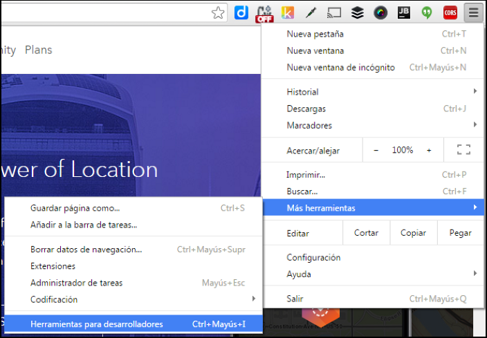
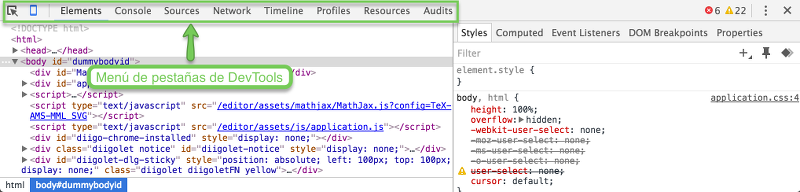
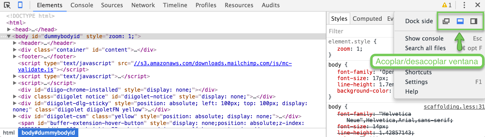

# Chrome DevTools

En esta lección vamos a empezar a trabajar con las herramientas de Google Chrome para desarrolladores ([Chrome DevTools](https://developer.chrome.com/devtools))1. 

Como en las lecciones anteriores, si crees que ya dominas esta materia puedes probar a hacer el [ejercicio tipo test de esta lección](http://www.cursohtml5desdecero.com/tests/leccion3.html). Si sacas un 100% de aciertos puedes pasar a la siguiente, sino te recomiendo que no te la saltes.

## Pestañas

De momento sólo vamos a ver 3 grupos de herramientas que se encuentran organizadas por pestañas:

* **Red** (*Network*): esta pestaña nos permite ver los *recursos* que recupera nuestro navegador usando peticiones HTTP mientras cargamos y usamos la página.

* **Elementos** (*Elements*): nos permite ver y modificar el código HTML2 que representa la página que estamos viendo.

* **Fuentes** (*Sources*): nos permite navegar por todos los ficheros (HTML, CSS y JavaScript) que utiliza la página que estamos viendo.

La barra de herramientas la podemos abrir en cualquier página que estemos viendo. Para abrir esta barra podemos hacerlo mediante un atajo de teclado o mediante el menú de herramientas del Chrome:

* **[Atajo de teclado](https://developer.chrome.com/devtools/docs/shortcuts#opening-devtools)** (recomendado):
   * En Windows pulsando: F2 o Control + Shift + I
   * En Mac pulsando: Cmd + Opt + I
* **Pulsando el botón de menú**: "Botón de menú" -> "Más herramientas" -> "Herramientas para desarrolladores".  Como podemos ver en la siguiente imagen.

Una vez hecho esto nos aparecerá la barra de herramientas:

La barra podemos ajustarla a la derecha, abajo o desacoplarla en una nueva ventana como vemos a continuación: 

Vayamos ahora analizando las pestañas.

<small>Aclaraciones:</small> 
<small>1. Puedes ampliar toda la información que veremos en este capítulo en la [página de documentación para desarrolladores de Google Chrome](https://developer.chrome.com/home), en el curso [Discover DevTools](https://www.codeschool.com/courses/discover-devtools) o para los más avanzados en el curso [Website Performance Optimization](https://www.udacity.com/course/website-performance-optimization--ud884)</small> 
<small>2. Y el CSS, aunque de momento no nos entretendremos en esta parte.</small> 