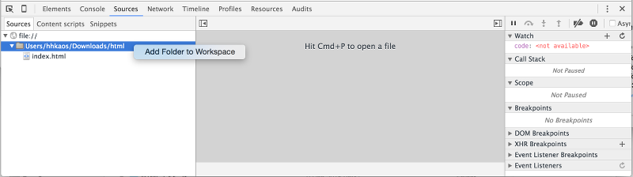
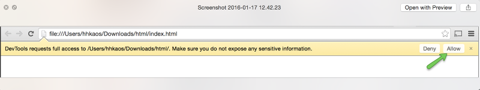
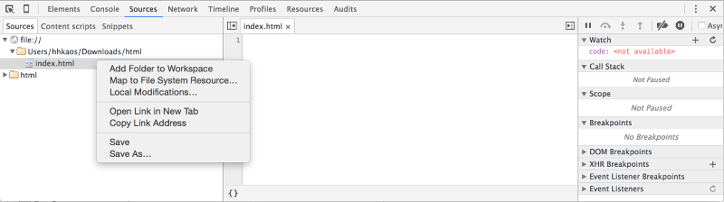

# Configuración

Ahora vamos a ver cómo podemos configurar Google Chrome para poder modificar ficheros que se encuentren en nuestro disco duro.

Para hacer esto usaremos los "**Workspaces**" que nos permitirán realizar cambios persistentes en nuestro código sin tener que ejecutar otro editor de código.

Para ello vamos a seguir los siguientes pasos:
1. Creamos una carpeta (de prueba) en nuestro disco duro (por ejemplo "*html*").
2. Creamos un fichero vacío dentro de la carpeta llamado. "*index.html*"1
3. Abrimos el fichero con Google Chrome
4. Abrimos las DevTools y nos vamos a la pestaá "**Sources**",
5. Hacer clic en el panel izquierdo sobre la ruta del directorio y seleccionamos **Add Folder to Workspace**

6. Y por último pulsamos "Allow" para autorizar a DevTools a realizar cambios persistentes en el disco duro: 

Ahora tenemos que vincular el fichero que queremos modificar, para ello:
1. Hacemos clic con el botón derecho sobre el nombre del fichero (*index.html* que cuelga de "file://")
2. Elegimos la opción "**Map to File System Resource**":
3. Seleccionamos el fichero dentro del espacio de trabajo (workspace).
4. Y refrescamos la página.

Y ya estamos listos para empezar a programar usando las Chrome DevTools
https://developers.google.com/web/tools/setup/setup-workflow 
Control P

Las modificaciones del CSS en elements ...

<small>Aclaraciones:</small> 
<small>1. A pesar de que no vamos a usar aún un servidor web, lo llamaremos así para ir acostumbrándonos a este nombre. Por defecto los servidores web cuando reciben la petición de un recurso y no se indica explícitamente el nombre del recurso, busca en la carpeta un fichero con nombre "index.html", y lo devuelve en caso de encontrarlo.</small> 
