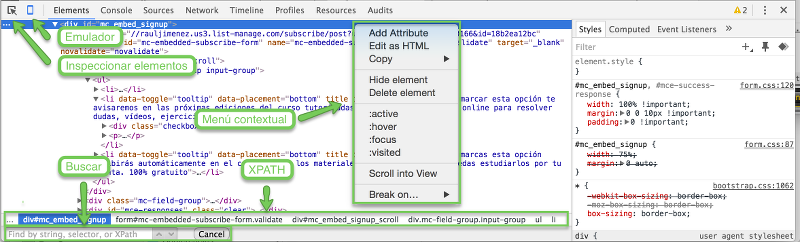

# Pestaña elements

La pestaña "**Elements**" representa lo que llamaremos el "**[DOM](https://es.wikipedia.org/wiki/Document_Object_Model)**" (*Document Object Model*), que no es más que la página que estamos viendo.

El DOM lo construye el navegador a partir del código HTML que recibe tras hacer la petición HTTP inicial. Además, intentar arreglar cualquier error que se encuentre en el código, por ejemplo: si se nos olvida cerrar una etiqueta o anidamos etiquetas que no son anidables, etc. Por ese motivo y porque el DOM se puede modificar (usando JavaScript por ejemplo), el DOM se parece pero no suele ser exáctamente igual al código HTML recibido en la petición HTTP.

Además de poder ver el DOM, podemos editarlo, hacer búsquedas de texto y hasta reordenar etiquetas arrastrándolas con el ratón.

En la siguiente imagen vemos las diferentes partes de esta pestaña:

* **Emulador**: esta opción nos permitirá simular que estamos usando una móvil o tablet, al igual que hacer *throttling* (simular otro tipo de conexión) al igual que hemos visto en la pestaña de red.
* **Inspeccionar elementos**: activando esta opción podrás hacer clic sobre cualquier parte de la página y el inspector señalará el código que representa el elemento seleccionado.
* **Menú contextual**: pultando el botón derecho sobre el código veremos varias opciones:
    * **Add attribute**: permite añadir un atributo, por ejemplo: charset="UTF-8".
    * **Edit as HTML**: no permite añadir, editar o quitar cualquier cosa. Atajo de teclado: F2 (Windows y Mac)
    * **Copy**: nos permite copiar el código (*outerHTML*), el selector (ya veremos lo que significa cuando veamos CSS), el [XPath](https://es.wikipedia.org/wiki/XPath)2 (es un lenguaje que nos permite buscar y seleccionar elementos teniendo en cuenta la estructura jerárquica del código), cotar y copiar el elemento.
    * **Ocultar elemento**: cambia la visibilidad a "oculto" usando CSS.
    * **Delete element**: permite eliminar el elemento. Atajo de teclado: Suprimir o borrar.
* **Buscar**: Nos permite buscar cualquier palabra dentro del DOM.
* **Jerarquía**: nos muestra todos los ancestros del elemento y nos permite seleccionarlos.

Los cambios que hagas sobre esta pestaña no se guardarán ya que estamos modificando el DOM, no el fichero de código (y ya hemos visto la diferencia), por tanto al refrescar la página todos los cambios desaparecerán.

Si pulsas Ctrl+Z (o Cmd+Z en Mac) podrás además deshacer los cambios realizados.

El panel que sale a la derecha es el CSS que se le ha aplicado al elemento seleccionado, pero esto ya lo veremos más adelante.

<small>Aclaraciones:</small> 
<small>1. Puedes encontrar la definición formal del DOM en la [página del W3C](https://www.w3.org/DOM/).</small> 
<small>2. Puedes encontrar la definición formal de XPATH en la [página del W3C](https://www.w3.org/TR/xpath/)
</small> 