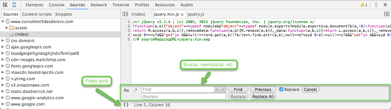

# Pestaña sources

La pestaña "**Sources**" nos muestras las fuentes de contenido que se han utilizado para construir la página. Desde esta pestaña podemos escribir y modificar ficheros que estén vinculados a nuestro disco duro, pero veremos cómo hacer esto en el siguiente apartado.

Empecemos por describir los distintos paneles:

* **Sources**: aquí encontraremos una jerarquía de ficheros por cada dominio desde el cual nuestro navegador haya obtenido recursos1 HTML, CSS o JavaScript. Haciendo clic en cualquiera de ellos se abrirá el código en una nueva pestaña en el panel derecho.
* **[Content scripts](https://developer.chrome.com/extensions/content_scripts)**: aquí se encuentran ficheros JavaScript implementados por algunas extensiones de Google Chrome que podamos tener instaladas.
* **[Snippets](https://developers.google.com/web/tools/chrome-devtools/debug/snippets/?hl=en)**: esta pestaña nos permite crear pequeños trozos de código2 JavaScript que podremos ejecutar o reutilizar en cualquier página.
* **Depurador**: este panel nos permite utilizar el depurador de código de JavaScript, veremos como usarlo en posteriores lecciones.
 
Al igual que en la lección anterior, te recomiendo que guardes en un lugar seguro los [atajos de teclado del panel Sources](https://developers.google.com/web/tools/chrome-devtools/iterate/inspect-styles/shortcuts#sources-1) y de vez en cuando los revises para aumentar tu productividad.

## Panel de contenido
Es importante saber que a diferencia de la pestaña "**Elements**", para poder ver los cambios reflejados en la página que estamos viendo es necesario **guardar los cambios y refrescar la página**.

El panel de contenido nos ofrece un [editor de código](https://es.wikipedia.org/wiki/Editor_de_c%C3%B3digo_fuente) que dispone adicionalmente de [otros atajos te teclado](https://developers.google.com/web/tools/chrome-devtools/iterate/inspect-styles/shortcuts#within-the-code-editor).

En principio me gustaría destacar cuatro especialmente útiles:

Windows/Linux   | Mac           | Función
----------------|---------------|---
Ctrl + F        | Cmd + F       | Buscar (y adicionalmente) texto dentro de un fichero
Ctrl + S        | Cmd + S       | Para guardar un fichero
Ctrl + P        | Cmd + P       | Buscar ficheros por nombre 
Ctrl + P + :**num**| Cmd + P + :**num**| Acceder directamente a un número de línea

La opción "**Prety print**" veremos que es especialmente útil cuando estemos depurando bibliotecas JavaScript minificadas, aunque de momento no te preocupes por esto.

<small>Recursos y aclaraciones:</small> 
<small>1. Normalmente mediante peticiones HTTP aunque puede que también mediante las extensiones de Chrome.</small> 
<small>2. En este repositorio de Github podrás encontrar una [colección de snippets](https://github.com/bgrins/devtools-snippets).</small> 
