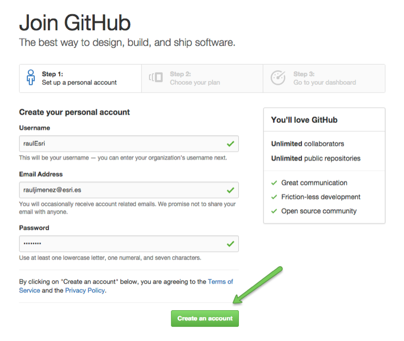
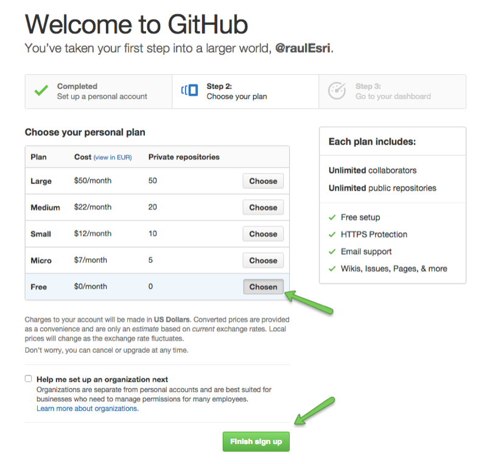
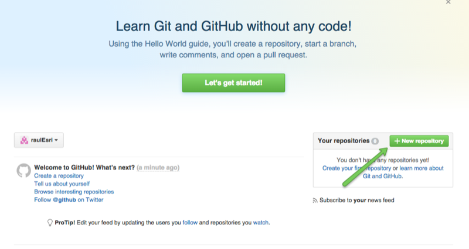
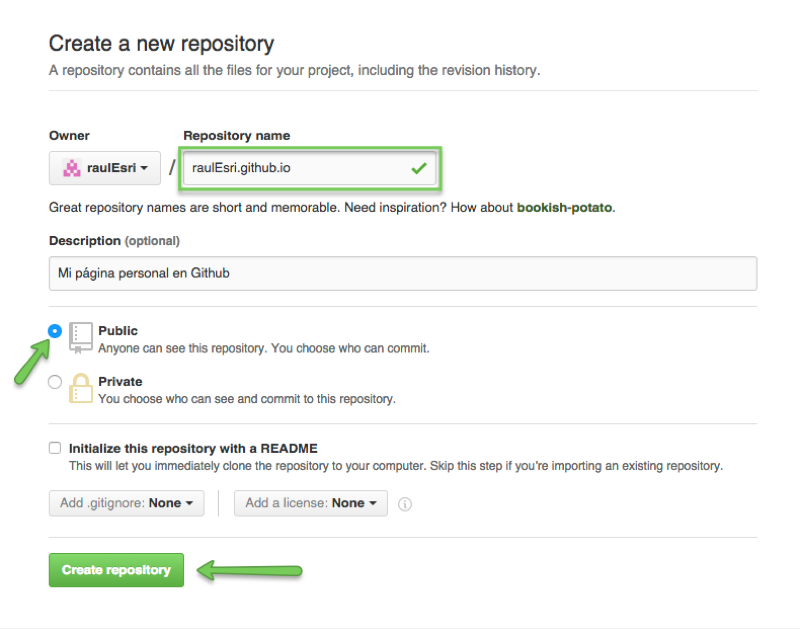

# Configurar nuestra cuenta

Vamos a empezar por crear una cuenta en Github.

Primero vamos a la [sección "Signup"](https://github.com/join?source=header-home) y completamos nuestros datos:

>  **Nota**: El username definirá la URL de nuestra cuenta: [http://github.com/**username**](http://github.com/**username**)

A continuación elegimos el plan gratuito:

Ahora vamos a crear un nuevo repositorio. Crearemos **un repositorio para cada proyecto** que vayamos a crear, para que nos hagamos una idea tendremos un repositorio por cada carpeta raíz que tengamos en nuestros disco duro. 

A este repositorio le daremos un nombre que Github tratará de manera especial1, el nombre debe ser: **username**.github.io, en mi caso raulEsri.github.io.

Luego puedes ponerle una descripción del contenido del proyecto, por ejemplo: *Mi página personal en Github*. Y seleccionamos que será un proyecto público (el código será accesible por cualquier persona).

Y ya está, ¡enhorabuena!, ya tienes una cuenta en Github. Cualquier persona podrá ver todos tus repositorios públicos en: [http://github.com/**Username**](http://github.com/**Username**), en mi caso mi repositorio sería: [~~http://github.com/raulEsri~~](http://www.github.com/raulEsri), mi repositorio real es [http://github.com/hhkaos](http://www.github.com/hhkaos) (el otro lo he creado simplemente para hacer este tutorial).

---
Aclaraciones:

1. El código que tengamos en este repositorio nos los servirá usando un servidor HTTP a través del dominio [http://**username**.github.io](http://username.github.io), por ejemplo en mi caso el repositorio de web cuenta personal es [http://hhkaos.github.io](http://hhkaos.github.io) y el código está en [https://github.com/hhkaos/hhkaos.github.io](https://github.com/hhkaos/hhkaos.github.io).