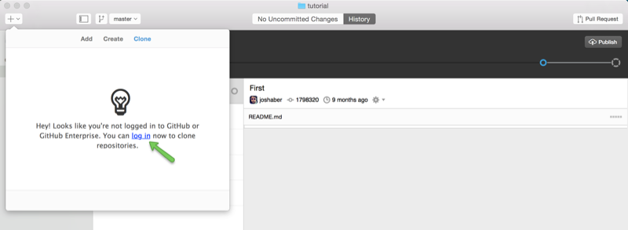
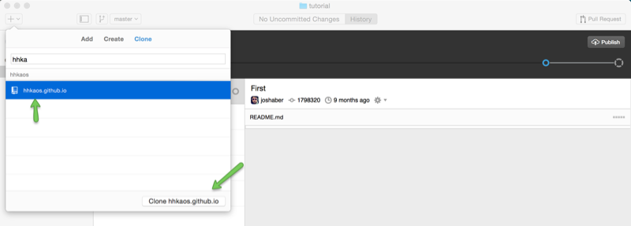

# Enviar y recibir cambios

Vamos a empezar por configurar 

[](../images/github_desktop_1.png)

[](../images/github_desktop_2.png)

Crear un nuevo repositorio desde la línea de comandos:
```bash
echo "# raulEsri.github.io" >> README.md
git init
git add README.md
git commit -m "first commit"
git remote add origin https://github.com/raulEsri/raulEsri.github.io.git
git push -u origin master
```