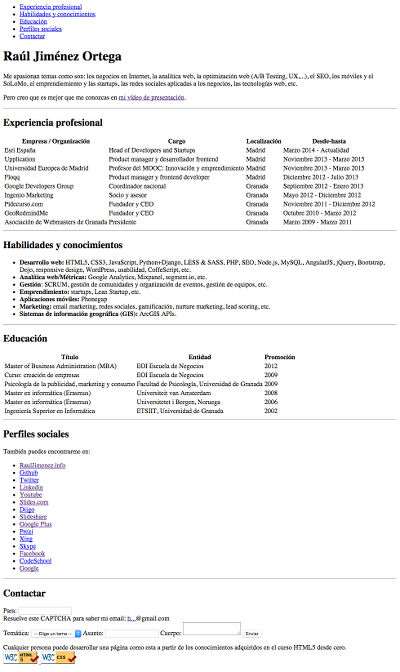

# HTML5: Mi Curriculum Vitae
En este capítulo vamos a aprender todo lo necesario para crear el código HTML de una página con nuestro CV, y en el siguiente aprenderemos cómo podemos subir nuestro curriculum a un repositorio de Github y a ponerlo accesible para cualquier persona usando gh-pages.

Por tanto al terminar este apartado tendremos que haber creado una página HTML [similar a esta](http://hhkaos.github.io/vanilla.html):

---

---

Así que vamos a empezar por ver los elementos HTML que nos faltan por aprender para poder llegar a hacerlo.