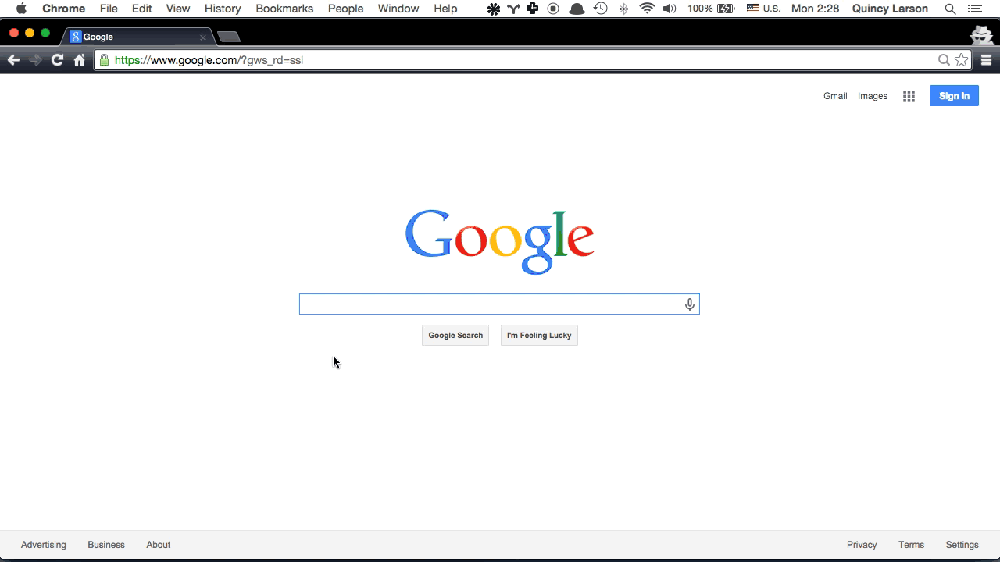

# Errores frecuentes

Este es un listado de alguno de los errores más frecuentes en HTML:
* No poner el encoding UTF-8 hará que algunos caracteres se muestren de manera extraña
* Poner dos identificadores iguales (suele pasar al copiar y pegar código). Esto nos dará problemas de validación y al
intentar acceder al elemento usando JavaScript
* Introducir & en las URLs; en su lugar se debe usar &amp;
* Anidamiento incorrecto, ya sea por no cerrar tags en el orden correcto como por anidar elementos de bloque en
elementos en linea, por ejemplo: ```<a href="#"><h2>Título</h2></a>```
* Utilizar los elementos ```<b>``` o ```<i>``` para darle estilo
* Usar múltiples <br> consecutivamente en lugar de usar estilos

Estos son sólo algunos errores frecuentes, pero en ningún libro, manual, tutorial o curso encontrarás todos
los errores que te pueden suceder, por eso es importante que aprendas a buscar las soluciones a los problemas que
te vayan surgiendo, mis consejos:
* Lee **atentamente** el error
* Usa Google para buscar tu error (a ser posible busca en inglés)
* Intenta reducir la frase a las palabras clave como el lenguaje, el número de error, ...

Cuando encuentres alguna página donde parezca haber una respuesta, fíjate en:
* Que la fecha de la respuesta sea relativamente nueva (no más de 2 años)
* Busca en la documentación oficial
* Si estás en Stackoverflow revisa el número de valoraciones positivas de la respuesta

Si no encuentras el error pide ayuda.

[](../images/buscar_error.gif)