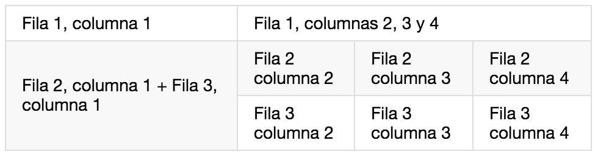
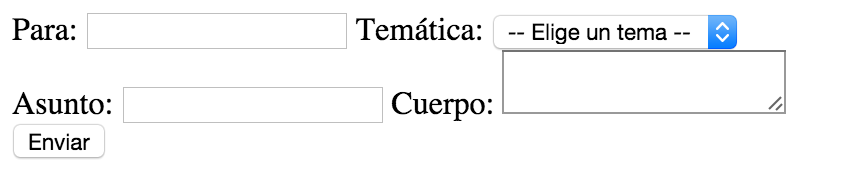

# Etiquetas - Parte 2
Ahora vamos a ver las etiquetas básicas para trabajar con: enlaces o hipervínculos, imágenes, tablas, formularios, separadores y otras consideraciones.

Esta vez tampoco veremos todos los atributos posibles aunque añadiré enlaces a la documentación:

## Enlaces o hipervínculos
Una de las características más destacables de HTML es la posibilidad de enlazar unas páginas con otras, para hacer esto utilizamos el elemento "**[a](https://www.w3.org/TR/2014/REC-html5-20141028/text-level-semantics.html#the-a-element)**" con el atributo "**href**" (Hypertext Reference). Por ejemplo:

```html
<a href="http://www.cursohtml5desdecero.com">Curso de HTML5 desde cero</a>
```

Hay 3 tipos de enlaces:
* **Absoluto**: es un enlace que incluye todas las partes de una URL como vimos en el capítulo 1: <br>```scheme:[//[user:password@]host[:port]][/]path[?query][#fragment]```
* **Relativo**: hace referencia a un recurso que se encuentra en una posición relativa a nuestra URL, así podemos establecer rutas relativas, por ejemplo: 
```html
<a href="img/imagen1.jpg">enlace a una imagen</a>
``` 
Donde indicamos que si por ejemplo la URL actual es http://www.cursohtml5desdecero.com/leccion1, la imagen se encuentra en http://www.cursohtml5desdecero.com/leccion1/img/imagen1.jpg, y si queremos hacer referencia a un recurso que se encuentra en un nivel superior del "**path**" lo hacemos usando "**../**", por ejemplo:
```html
<a href="../img/imagen1.jpg">enlace a una imagen</a>
``` 
Que hará referencia a la siguiente URL: http://www.cursohtml5desdecero.com/img/imagen1.jpg (eliminamos **leccion1**).
* **Ancla (o *anchor*)**: a diferencia de los dos anteriores, este enlace se utilizar para indicar un elemento dentro de la misma página que estamos viendo. Para ello tenemos que explicar un nuevo tipo de atributo que tienen todos los elementos en HTML, el **[id](https://www.w3.org/TR/2014/REC-html5-20141028/dom.html#the-id-attribute)** (*unique identifier*), como su nombre indica es un identificador único y por tanto no podemos ponerle a dos elementos HTML el mismo **id**. Luego para añadir un hipervínculo a este elemento sólo tenemos que establecer el atributo **href** del enlace al **id** del elemento precedido de una almohadilla (#), por ejemplo:
```html
<a href="#leccion1">Lección 3</a>
...
<!-- aquí vendría todo el contenido -->
<h2 id="leccion1">Lección 3</h2>
```
Esto estamos acostumbrado a verlo en la Wikipedia, por ejemplo: <br>
https://en.wikipedia.org/wiki/Hyperlink#Hyperlinks_in_HTML

## Imágenes
Para mostrar una imagen en una página tenemos dos formas de hacerlo, una es usando el elemento **[img](https://www.w3.org/TR/2014/REC-html5-20141028/embedded-content-0.html#the-img-element)** y otras es mediante CSS (que veremos en el capítulo correspondiente).

Esta etiqueta sólo requiere de dos atributos obligatorios que son: **src** (de *source*) y el otro es **alt** (de *alternative*), por ejemplo:
```html

```
Como podemos deducir del código anterior, el atributo **src** lo usaremos para indicar la URL (absoluta o relativa) a la imagen, y **alt** como el texto (alternativo) que mostrará el navegador en caso de no encontrar la imagen<sup>1</sup>.

## Tablas
Podemos crear tablas en HTML usando el elemento **[table](https://www.w3.org/TR/2014/REC-html5-20141028/tabular-data.html#the-table-element)**<sup>2</sup>. Para ello como mínimo tendremos que indicar las filas y las columnas usando los elementos **tr** (*table row*) y **td** (*table data*) respectivamente, así por ejemplo:

```html
<table>
    <tr>
        <td>Fila 1, columna 1</td>
        <td>Fila 1, columna 2</td>
    </tr>
    <tr>
        <td>Fila 2, columna 1</td>
        <td>Fila 2, columna 2</td>
    </tr>
</table>
```
Que daría un resultado como el siguiente:

<table>
    <tr>
        <td>Fila 1, columna 1</td>
        <td>Fila 1, columna 2</td>
    </tr>
    <tr>
        <td>Fila 2, columna 1</td>
        <td>Fila 2, columna 2</td>
    </tr>
</table>

Como podemos comprobar las columnas (**td**) siempre van contenidas dentro de las filas (**tr**). En caso de querer agrupar celdas de una misma fila o columna lo haremos así:
* Misma fila: la usaremos el atributo **colspan** (*column span* = número celdas a abarcar)
* Agrupar dos celdas de una misma columna usaremos el atributo **rowspan** (*row span* = número de celdas a abarcar)

Por ejemplo:

```html
<table>
    <tr>
        <td>Fila 1, columna 1</td>
        <td colspan="3"> Fila 1, columnas 2, 3 y 4</td>
    </tr>
    <tr>
        <td rowspan="2">Fila 2, columna 1 + Fila 3, columna 1</td>
        <td>Fila 2 columna 2</td>
        <td>Fila 2 columna 3</td>
        <td>Fila 2 columna 4</td>
    </tr>
    <tr>
        <td>Fila 3 columna 2</td>
        <td>Fila 3 columna 3</td>
        <td>Fila 3 columna 4</td>
    </tr>
</table>
```
Quedando algo como esto:

[](../images/tableColRowSpan.png)

Como podemos ver el atributo afecta a las celdas de las siguientes columnas/filas y el valor indica cuántas celdas debe abarcar.

## Formularios
Vamos a hablar muy brevemente de los formularios, algunos de los elementos y de sus propiedades:
* **[form](https://www.w3.org/TR/2014/REC-html5-20141028/forms.html#the-form-element)**: contendrá todos los campos de nuestro formulario, incluído el botón de enviar.
    * **action**: indica la URL a la que se enviará la petición HTTP con toda la información del formulario
    * **method**: indica si la petición HTTP será *GET* o *POST*
* **[input](https://www.w3.org/TR/2014/REC-html5-20141028/forms.html#the-input-element)**: permite introducir diferentes *tipos* de campo de formulario en base al valor del atributo **type**. En función del valor indicado en **type** dispondremos de unos atributos u otros (en total hay 30, pero no todos aplican a todos los casos):
    * **type** (obligatorio): este valor puede tener [muchos valores](https://www.w3.org/TR/2014/REC-html5-20141028/forms.html#states-of-the-type-attribute): *text*, *email*, *checkbox*, *color*, *date*, *file*, *hidden*, etc. en función del tipo de campo que queramos, los nombres son bastante auto-explicativos.
    * **id**: este atributo es obligatorio si en el elemento **label** tiene un atributo **for**, en tal caso deberá contener un identificador único<sup>3</sup> en la página.
    * **name**: este atributo es opcional y representa el nombre asignado al campo cuando se envíe la petición HTTP.
    * **value**: este valor es opcional pero representa el valor que se asignará al campo cuando se envíe la petición HTTP.
* **[select](https://www.w3.org/TR/2014/REC-html5-20141028/forms.html#the-select-element)**: nos permite crear una lista desplegable de opciones, cada opción estará contenida como hija dentro de un elemento **option**.
    * **id**: igual que el elemento **input**
    * **name**: igual que el campo **input**
* **[option](https://www.w3.org/TR/2014/REC-html5-20141028/forms.html#the-option-element)**: nos sirve para "encapsular" cada opción de la lista.
    * **value**: igual que el atributo **value** del campo **input**.
* **[textarea](https://www.w3.org/TR/2014/REC-html5-20141028/forms.html#the-textarea-element)**: representa un campo que nos permite introducir textos con saltos de línea incluidos, normalmente se usa cuando hay que introducir: descripciones, biografías, etc.
    * **id**: igual que el elemento **input** y **select**.
    * **name**: igual que el campo **input** y **select**.
* **[label](https://www.w3.org/TR/2014/REC-html5-20141028/forms.html#the-label-element)**: se usa para especificar la etiqueta (o nombre) del campo del formulario.
    * **for**: tiene que tener el mismo valor que el atributo **id** del campo (input, select o textarea) al que hace referencia la etiqueta.
* **[button](https://www.w3.org/TR/2014/REC-html5-20141028/forms.html#the-button-element)**: representa un botón y el texto del botón está representado por su contenido.
    * **type**: define el comportamiento del botón cuando está activado y puede contener [tres valores](https://www.w3.org/TR/2014/REC-html5-20141028/forms.html#attr-button-type): *submit*, *reset*, *button*

Existen muchos otros atributos que no veremos dado que no les daremos uso en este curso ya que para sacarle el máximo provecho sería necesario tener conocimientos en programación.

Por último añadir que el elemento **input** no requiere una etiqueta de cierre (o lo que es lo mismo, que está autocontenido).

Aquí tenemos un ejemplo de formulario:

```html
<form action="miScript.php" method="GET">
    <label for="to">Para:</label>
    <input id="to" type="email">

    <label for="topic">Temática: </label>
    <select id="topic" name="topic">
      <option>-- Elige un tema --</option>
      <option value="proposal">Propuesta</option>
      <option value="report">Reporte</option>
      <option value="other">Otro</option>
    </select>

    <label for="subject">Asunto: </label>
    <input id="subject" name="subject" type="text">

    <label for="body">Cuerpo:</label>
    <textarea id="body" name="body"></textarea>

    <button type="submit">Enviar</button>
</form>
```
Que nos dará como resultado algo así:

[](../images/formulario.png)

Como ves los estilos por defecto serán muy poco atractivos, pero no te preocupes, ya aprenderemos a solucionar esto usando CSS.

Por último comentar que *en muchos de los elementos*<sup>4</sup> podemos añadir (opcionalmente) otros atributos como:
* **required** a un elemento para que el navegador se encargue de validar que este campo está relleno
* **readonly** si queremos que sea de sólo lectura
* **placeholder** si queremos que aparezca un texto de ayuda para rellenar el campo
* **value** para introducir un valor por defecto en el campo

Por ejemplo:

```html
<label for="to">Para:</label>
<input id="to" type="email" placeholder="tu@correo.com" required>

<label for="subject">Asunto: </label>
<input id="subject" type="text" value="Formulario de contacto" readonly>
```

## Separadores
Existe un elemento que nos permite añadir un separador (una línea horizontal), este elemento es **hr**.

## Otras consideraciones
Para terminar este capítulo hay una última cosa que me gustaría comentar:
* En HTML se ignoran todos los espacios a partir del primero, por lo tanto nunca podremos (*ni se debe*) alinear usando espacios. 
* Las entidades HTML (*HTML entities*) se usan para pintar palabras, caracteres o símbolos reservados o que puede que no tengas en tu teclado como por ejemplo: <, >, &copy;, &amp;, &euro;, etc. <br>Existen [1446 entidades](https://dev.w3.org/html5/html-author/charref) reservadas que puedes consultar en la página del W3C.

Para representar la entidades HTML se usa el siguiente formato:
```html
&código_de_la_entidad;
```

Veamos un ejemplo para entender mejor por qué existen las entidades HTML y cómo se usan. 

Imaginemos que estamos haciendo una página sobre matemáticas y queremos expresar la siguiente frase:
```
¿Qué valor tiene la variable X si sabemos que X < 2 y X > 0?
```

En este caso cuando el navegador esté intepretando el código HTML encontrará "**< 2 y X >**" e intentaría interpretarlo como un elemento HTML pero no podría ya que ese elemento no existe.

Para evitar este problema usaríamos el siguiente cógido HTML:
```html
¿Qué valor tiene la variable X si sabemos que X &lt; 2 y X &gt; 0?
```
En este caso hemos modificado el símbolo "menor que" (**L**ower **T**han) por la entidad HTML **lt** y "mayor que" (**G**reater **T**han) por **gt**, así el navegador podrá representarlo sin ningún problema.

En alguna ocasión puede que navegues por una página con una codificación (encoding) que no soporte los acentos agudos (á, é, í, ó, ú), en ese caso usarán las entidades HTML (```&aacute;, &eacute;, &iacute;, &oacute;, &Uacute;```) para representarlos. Por cierto: "acute" en inglés significa "agudo".


<small>Aclaraciones:</small><br>
<small>1. Puede que no se encuentre la imagen porque alguien la borre del servidor o porque nos equivoquemos al introducir la URL.</small><br>
<small>2. Las tablas sólo deben usarse para mostrar datos que tengan sentido en una tabla y nunca para maquetar.</small><br>
<small>3. Con esto nos referimos a un nombre (o cadena de texto) que no contenga ningún otro elemento, por ejemplo no puede haber dos elementos con **id="email"**.</small><br>
<small>4. En la documentación del W3C podemos ver qué atributos admite cada elemento: [input](https://www.w3.org/TR/2014/REC-html5-20141028/forms.html#input-type-attr-summary), [textarea](https://www.w3.org/TR/2014/REC-html5-20141028/forms.html#the-textarea-element), [select](https://www.w3.org/TR/2014/REC-html5-20141028/forms.html#the-select-element), etc.</small><br>

