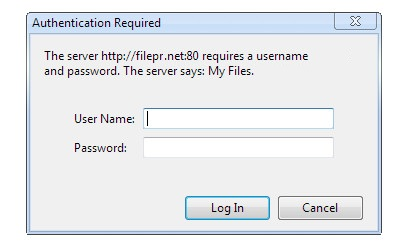

# URLs

Para acceder a un fichero/recurso a través de un navegador usamos la URL (Uniform Resource Locator). Cualquier URL sigue el siguiente formato:

```
scheme:[//[user:password@]host[:port]][/]path[?query][#fragment]
```

**Aclaración**: En informática se utilizan los corchetes **[ ]** para indicar que lo que se encuentra contenido entre ellos es opcional.

Vamos a hacer un pequeño repaso a cada una de las partes de la URL:

* **scheme (obligatorio)**: este suele ser http o https normalmente, aunque podría ser también: file, ftp, mailto, data, skype, etc.
* **user:password@**: usuario y contraseña (p.e. hhkaos:mipass@). Esto normalmente se utiliza por ejemplo en conexiones FTP o SSH que requieren autentificación. También se puede usar si queremos identificarnos directamente en un sistema que use [.htpasswd](https://en.wikipedia.org/wiki/.htpasswd) como en el que se muestra en la siguiente imagen:<br>
* **host**: nombre de dominio (p.e. rauljimenez.info) o dirección IP del servidor web (p.e. 79.82.123.1)
* **port**: puerto (si no se especifica ninguno se usa el 80 por defecto)
* **path (obligatorio)**: ruta al fichero (p.e. blog/index.php)
* **query**: parámetros/variables (p.e. preview=true)
* **fragment**: punto de anclaje (p.e. #introducción)

Así una URL válida podría ser:
```
https://hhkaos.gitbooks.io/introduccion-a-html5/content/chapter1.html#primeros-pasos-con-html5
```
Donde:
- scheme = https
- user:password@ = (vacío)
- host = hhkaos.gitbooks.io
- port = 80
- path = introduccion-a-html5/content/chapter1.html
- query = (vacío)
- fragment = #primeros-pasos-con-html5 

Otro ejemplo de URL válida podría ser: ```file:///Users/hhkaos/index.html```

En este caso estamos le estamos indicando al navegador que acceda a un fichero que se encuentra en nuestro disco duro.