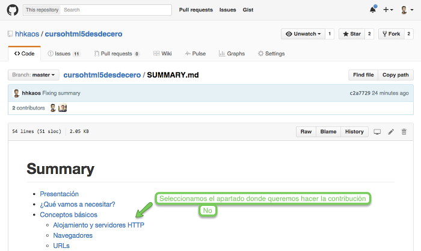
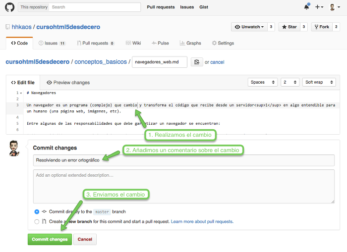

# Contribuciones

Cualquier persona puedes contribuir de diferentes formas:
1. Ayudando a mejorar los contenidos del libro o los ejercicios
2. Colaborando en mejorar la página web
3. Ayudando con las aplicaciones móviles

Para facilitar la comunicación entre todas las personas que quieran contribuir se ha creado un [canal en Gitter](https://gitter.im/hhkaos/cursohtml5desdecero). A continuación explicamos cómo contribuir en cada apartado.

## Libro

### Contenidos

Estado de las tareas: [Waffle](https://waffle.io/hhkaos/cursohtml5desdecero?milestone=Contenidos%20del%20curso) | [Github](https://github.com/hhkaos/cursohtml5desdecero/issues?q=is%3Aopen+is%3Aissue+milestone%3A%22Contenidos+del+curso%22)

Cualquier persona puede ayudar a introducir mejoras, corregir errores tipográficos, gramaticales, etc.

Los pasos son muy sencillos, primero accedemos a la [página con el índice del libro en Github](https://github.com/hhkaos/cursohtml5desdecero/blob/master/SUMMARY.md) y seguimos los siguientes pasos:

### Ejercicios

Estado de las tareas: [Waffle](https://waffle.io/hhkaos/cursohtml5desdecero?milestone=FreeCodeCamp) | [Github](https://github.com/hhkaos/cursohtml5desdecero/issues?q=is%3Aopen+is%3Aissue+milestone%3AFreeCodeCamp)

Por definir

## Página web

Estado de las tareas: [Waffle](https://waffle.io/hhkaos/cursohtml5desdecero?milestone=Web%20promocional) | [Github](https://github.com/hhkaos/cursohtml5desdecero/issues?q=is%3Aopen+is%3Aissue+milestone%3A%22Web+promocional%22)

Por definir.

## Aplicaciones móviles

Estado de las tareas: [Waffle](https://waffle.io/hhkaos/cursohtml5desdecero?milestone=Aplicaciones%20m%C3%B3viles) | [Github](https://github.com/hhkaos/cursohtml5desdecero/issues?q=is%3Aopen+is%3Aissue+milestone%3A%22Aplicaciones+m%C3%B3viles%22)

Por definir.